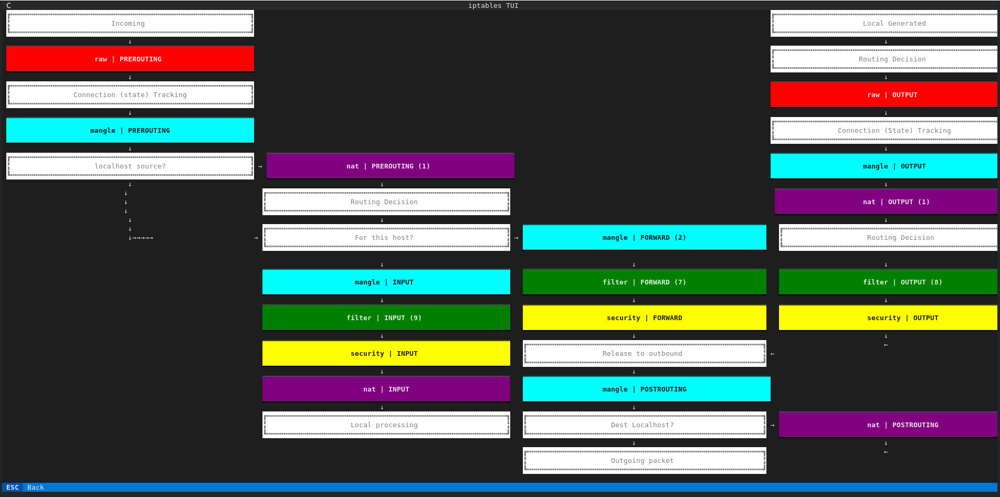
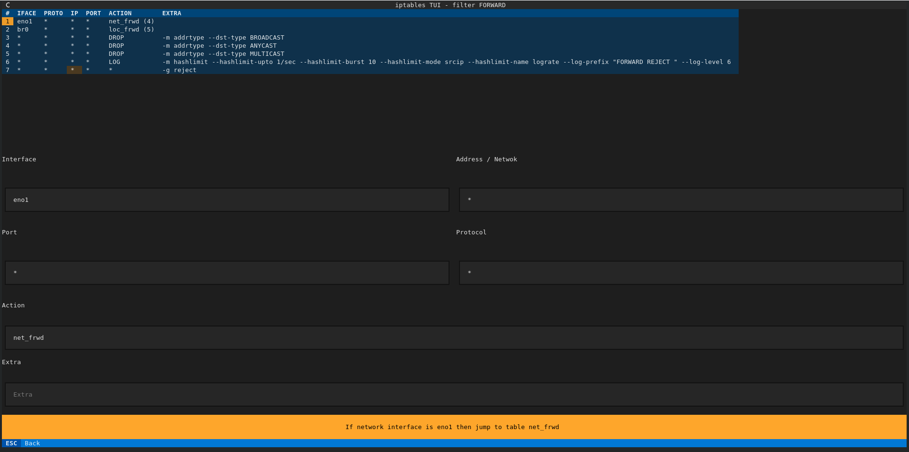

# iptables-tui

Terminal User Interface for iptables

## The table select flow diagram

My worst enemy to try to understand iptables was not knowing this diagram.
With it, its easy to see how packets flow.

## Chain table editor

Each table has several chains, and it can have also user generated ones.
With this view its possible to see each rule and navigate to inner tables.

## References

- Flowchard adapted from https://stuffphilwrites.com/2014/09/iptables-processing-flowchart/ . Thanks!
